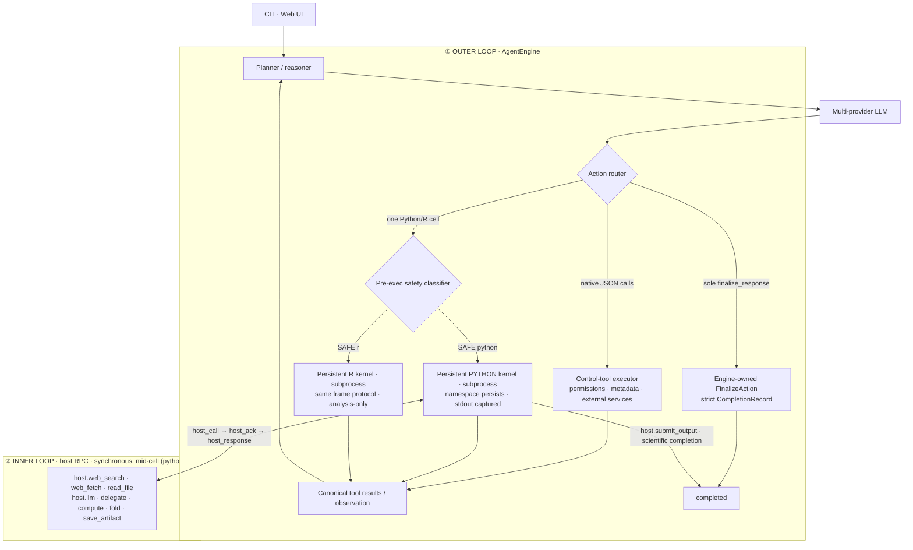

# Architecture — hybrid control plane and science runtime

OpenAI4S drives the model with one outer agent loop and two deliberately
different action channels:

- **Native JSON tool calls are the orchestration control plane.** They handle
  deterministic metadata operations, external services, permissions, and
  workflow control through provider-native structured calls.
- **Python/R Code-as-Action is the scientific execution plane.** Real
  computation runs in persistent language kernels. Python may synchronously
  call back into host services while a Cell is still executing; R remains an
  independent analysis channel without mid-Cell Host RPC.

The channels never compete in one step: structured calls take priority;
otherwise exactly one complete Python/R cell may run. A sole, valid
`finalize_response` call is routed as an Engine-owned `FinalizeAction`; it may
close a tool-only response or a run that executed Cells earlier. A Python Cell
can instead complete from inside the kernel with `host.submit_output(...)`.
Ordinary prose, a normal tool result, an R Cell, cancellation, or maximum-turn
stop is not completion.



- **① Outer loop** — [`agent/engine.py`](../openai4s/agent/engine.py)
  owns the provider-neutral state machine. [`agent/actions.py`](../openai4s/agent/actions.py)
  chooses a native tool batch, Engine-owned `FinalizeAction`, one Python/R
  cell, or no action.
  [`agent/runtime.py`](../openai4s/agent/runtime.py) connects the engine to the
  local LLM client, compaction, kernels, dispatcher, and CLI transcript;
  [`server/agent_run.py`](../openai4s/server/agent_run.py) projects the same
  engine events and actions onto persistent Web sessions and WebSocket events.
- **② Inner loop** — *within a single cell*, agent code can call `host.llm(...)` / `host.delegate(...)` / `host.compute(...)` any number of times. Each is a synchronous `host_call → host_ack → host_response` RPC on a channel **separate from stdout capture**, so the cell blocks, the host services the call mid-execution, and the cell resumes. **This inner RPC loop does not exist in a `tool_use` architecture** — there, actions are atomic and never call back into the host mid-execution.

`AgentEngine` imports no concrete kernel, dispatcher, store, or server. Those
are ports assembled by entry-point adapters. The Engine is ledger-first: an
append-only action group is opened before execution, tool results and Cell
attempt milestones close it canonically, and terminal state is appended rather
than inferred from the UI transcript. This keeps terminal states, history
ordering, provider replay, and action priority testable without starting
infrastructure.
For Web sessions, tool/cell-only replies receive a deterministic public action
notice that never exposes hidden reasoning or raw arguments. On successful
submission, the Gateway projects the structured output, completion bullets,
and actual Artifact-version delta into the final assistant message before the
terminal frame event; a provider cannot leave the user with an empty reply.
With Stage 1 trusted delivery enabled, every Artifact link in that final
projection names an exact immutable `version_id` through the shared server URL
helper's reserved `/api/v1/artifacts/versions/{version_id}` namespace. The
verified manifest and assistant message commit before the
link-bearing `text_chunk` is emitted.

### Auto Mode durable boundary after Stage 2

Stage 2 implements the data and projection foundation behind the default-off
`stage2_auto_run_storage` flag. SQLite is authoritative for Auto Runs, canonical
events, result/permission audit owners, findings, Repair Runs, and exact Repair
action-ledger bindings. Every fact carries root, branch, turn, and execution
identity. Checkpoints freeze an `auto_event_cursor`; fork/revert projects the
logical branch prefix while retaining abandoned physical tails for audit. Each
transition commits before its canonical WebSocket hint, so a lost socket is
recovered through REST/reopen rather than by replaying a side effect.

This is deliberately a storage stage. It does **not** invoke a Scientific
Reviewer, Repair Agent, or Permission Guardian, does not gate completion, and
does not resolve a permission. The `autonomous` selection still means one
bounded preset (`auto_fix` + `auto_review` + deployment hard ceilings),
not a permission tier. With the Stage 2 flag off, GET remains an explicit inert
projection and PATCH is refused. Imported history is always quarantined,
unverified, `off`/`user`, identity-remapped, and non-resumable.

The only Stage 2 event vocabulary is `auto_run_started`, `candidate_ready`,
`auto_audit_started`, `auto_audit_completed`, `repair_started`,
`repair_completed`, and `auto_run_terminal`. Both audit kinds share the audit
events and are distinguished by the closed subject pairs
`result_review/candidate_evidence_snapshot` and
`permission_review/approval_action`; aliases are rejected. Local Verified
projection revalidates the durable candidate, independent review envelope,
ordered findings, event hashes, and owner bindings on every read. An integrity
failure is shown as `failed` with `terminal_reason=safety_boundary`, never as
Reviewer unavailability or Verified.

The existing optional evidence Reviewer is a constrained single LLM call that
runs after the final answer and persists an ordinary review step. It is not a
completion gate and its historical `auto_review` name is not the new Auto Mode.

#### Stage 3 Scientific Reviewer shadow

`OPENAI4S_STAGE3_SCIENTIFIC_REVIEW_SHADOW=1` records an independent V2
Scientific Review after the existing answer is already delivered. It does not
change user-visible completion, does not start Repair, and does not write the
formal workspace. The Reviewer receives only a frozen Evidence Snapshot: user
request, plan, candidate, structured completion, this-turn artifact versions
and checksums, cells, tool ledger, lineage, environment, source metadata,
adapter coverage, and every omission/truncation. Filename-only coverage of
PDF, image, structure, or table artifacts is incomplete and cannot pass.

The Reviewer identity is frozen as `profile_id + profile_revision +
(provider, base_url, model)` fingerprint for the run. `review_only` may use
the same model in a separately labelled independent session; `auto_fix`
requires a different fingerprint or records `review_unavailable` with
`reviewer_independence_unavailable` instead of claiming an independent
recheck. Plan turns are included. Scratch verification is isolated: no
network, no formal-workspace write, no MCP, no `submit_output`. Findings
must cite snapshot `evidence_refs`; a forged ref is itself a high finding.

#### Stage 4 completion gate

`OPENAI4S_STAGE4_REVIEW_COMPLETION_GATE=1` changes promotion order when result
review is selected: candidate → frozen snapshot → review → promotion. Streamed
prose and the composed answer are marked `provisional`. At the turn boundary
their exact concatenated bytes are written once as a canonical assistant row
with `review_status=candidate`, before the Reviewer is called. For a Stage 1
Artifact completion, the exact-version manifest and candidate row commit before
its links are exposed, but the delivery remains unpublished. A daemon lost
mid-review therefore reopens an explicitly unverified candidate rather than
losing the answer or presenting it as reviewed.

Promotion is a value, not just a veto: the gate returns the text that may be
delivered, which is how a Stage 5 repair reaches the user instead of being
computed and discarded. Verified is stamped only on the exact bytes the passing
review read; a repair the caller can no longer deliver, a mismatch between
delivered and reviewed text, and a delivery that fails after the review all
resolve to a non-verified terminal. A `pass` may become Verified; `issues`
become `completed_with_issues`; timeout/parse/provider failure after the
bounded retry is `review_unavailable`. The user still has the candidate
artifacts. With Stage 2 enabled, exact message content/verdict, completion
delivery publication, and the immutable Auto Run terminal are committed
together in one SQLite transaction. The CAS is scoped by message, root, branch,
frame, and original
candidate bytes; it never guesses the newest assistant row. Reopen reads that
durable assistant-row stamp, never a cached WebSocket badge or a root-only
setting.

#### Stage 5 auto-fix

`OPENAI4S_STAGE5_AUTO_REPAIR=1` with `result_review_mode=auto_fix` starts a
bounded Repair Run after issues. Repair uses a dedicated executor, not the
Reviewer. A repaired candidate is independently re-reviewed; it can be
Verified only when that fresh review also committed as durable proof. A repair
whose fresh proof cannot be persisted may still replace the incorrect prose,
but remains `completed_with_issues` and explicitly unverified. Unchanged finding
fingerprints or a spent repair budget also stop as `completed_with_issues`.
Identical Artifact bytes reuse the previous version. The Repair Agent cannot
declare Verified.

#### Stage 6 Guardian shadow

`OPENAI4S_STAGE6_GUARDIAN_SHADOW=1` records a non-executing Guardian judgment
on the exact action envelope of an `ask`. Human allow/deny still decides.
Guardian cannot create a standing allow. An action-hash mismatch fails closed.

#### Stage 7 Guardian enforcement

`OPENAI4S_STAGE7_GUARDIAN_ENFORCEMENT=1` lets an unattended Guardian resolve
only a non-dangerous deterministic `ask`, and only as a one-shot capability
bound to the exact action digest and run context. Hard policy denies retain
priority; no Guardian output can create a standing allow. Timeout, invalid
output, hash drift, audit failure, and the denial circuit all fail closed. The
credential-shaped workspace-target fence promotes an otherwise permissive
file rule to an audited `ask`: an attached human may decide it, while a
headless run is refused before Guardian rather than treating model review as a
credential bypass.

#### Stage 8 live Notebook and lineage

`OPENAI4S_STAGE8_LIVE_NOTEBOOK_LINEAGE=1` makes the live Notebook a first-class
execution path on the same kernel generation and FIFO coordinator. Host-side
file reads (Python and R) map to Artifact versions; a later write in that Cell
creates an input→output lineage edge. Reviewer snapshots cite those version
ids. Agent, user REPL, repair, and review scratch remain distinct owners.

#### Stage 9 Artifact workbench

`OPENAI4S_STAGE9_ARTIFACT_WORKBENCH=1` turns Artifact viewing into a workbench:
bounded full-dataset CSV/Parquet sort/filter/page, text version diffs, PDF/HTML
comments bound to a version and locator and quoted into the next turn, and the
vendored Ketcher 3.7.0 editor saving a new version of the same Artifact.
Projections reject snapshots above 32 MiB with `413 artifact_too_large`; tables
also cap rows, columns, cells, and Parquet decoded metadata before materializing
the optional engine. Diffs use a lower 8 MiB-per-version/50,000-line bound
because sequence matching retains both inputs and matching state.

#### Stage 10 scientific connectors

`OPENAI4S_STAGE10_SCIENTIFIC_CONNECTORS=1` adds ClinVar, PubMed, and
ClinicalTrials.gov to the existing science envelope. Empty results, 429s, and
schema drift are honest errors. A successful search records query, endpoint,
retrieved_at, source checksum, and accessions on a versioned Artifact.

#### Stage 11 durable remote compute

`OPENAI4S_STAGE11_DURABLE_REMOTE_COMPUTE=1` turns the existing durable job
ledger into the product path: a restarted manager only reconciles, never
resubmits; cancel still names the exact receipt; harvest Artifacts record the
remote environment, input versions, job receipt, and checksums.

#### Stage 12 GA

`OPENAI4S_STAGE12_AUTO_MODE_GA=1` arms the GA kill-switch declaration. Auto
Mode remains default-off. Earlier stage flags stay independently opt-in. The
evidence table for Stages 0–12 lives in
[auto-mode-stage12-evidence.md](auto-mode-stage12-evidence.md).

Stages 3–12 add the durable supervisor/services around the provider-neutral
`AgentEngine`; the Engine itself remains unaware of Web review and permission
product modes. See [Auto Mode contract](auto-mode.md) for the exact entry,
recovery, projection, and safety rules.

The Stage 6/7 Guardian is downstream only of deterministic `ask`. Existing hard
policy, sandbox, egress, biosecurity, secret/credential, cost, action-digest,
and audit-persistence controls always keep priority and are never relabelled as
Guardian decisions. Their committed reason remains precise: policy setup,
budget exhaustion, unknown external outcome, safe rollback unavailable, loop
detection, or a hard/integrity `safety_boundary`. Selection precedence and the
fixed finite budgets are frozen in the Auto Mode contract.

#### Trusted Artifact delivery and capture observations

The Stage 1 flag-on path treats delivery as an ordered, fail-closed protocol:

1. Artifact capture streams the workspace file into a temporary snapshot,
   verifies that the source identity, size, and time did not change while it
   was read, fsyncs the bytes, and atomically publishes the immutable snapshot
   before the version row can reference it.
2. Completion accepts exact version identities only and re-reads each trusted
   snapshot through a regular-file descriptor, checking its recorded size,
   SHA-256, session, and project. A filename or mutable Artifact head is never
   a substitute for a missing version.
3. The final assistant message and its canonical verified manifest enter
   SQLite in one transaction under an idempotency key. Only after that commit
   may the Gateway emit the link-bearing `text_chunk`, carrying a stable
   `delivery_id`. A lost socket publication leaves a committed message that
   REST reopen recovers, plus a queryable delivery fact for explicit/future
   reconciliation with the same id. The delivery ledger does not drive
   automatic re-emission; the ordinary bounded WebSocket sequence buffer may
   replay it while the turn remains live, and terminal/restart recovery uses
   REST. A verification or audit failure publishes no success link.

Session packages carry the delivery ledger beside the exact Artifact snapshots,
but never reuse source identities or URLs. Import verifies the restored local
snapshots, rebuilds each local manifest/URL, and atomically rebinds the remapped
assistant message. An envelope without its ledger (or the reverse), a changed
byte claim, or a partial bind rejects the package instead of projecting a link
that cannot reopen.

Artifact versions and capture observations answer different questions. A
version answers “which bytes?”; an observation answers “which Cell captured
these bytes on this occasion?”. When a flag-on capture has the same SHA-256 as
the current head, it reuses that version rather than creating a fake new one,
while appending a root/project-scoped observation for the new producing Cell,
environment/source details, and input-version lineage. The reused version keeps
its original producer and provenance. Stage 1 consumes these observations for
the local delivery delta and exposes the latest version's scope-checked,
path-free observations/producer frame through the Artifact lineage projection.
That lets the Provenance UI identify a delegated child without pretending it
was a root Notebook Cell. Session-package, share-snapshot, and Artifact-ZIP
serialization do **not** include a portable observation ledger; a client-side
metadata export only mirrors the current local lineage projection. Portable
observation serialization remains outside this rollout and must not be inferred
from the local table.

Truthful capture also requires exclusive authorship of the shared workspace.
With Stage 1 enabled, one per-session coordinator admits foreground capture,
independent background kernels, and person-facing Artifact mutations as three
mutually exclusive lifetime classes. Synchronous delegated children may nest
under the owning foreground thread; asynchronous/fanout delegation is refused
before work starts. Background admission spans worker creation through kernel
cleanup, and an external mutation spans its durable write and final event.
Session/branch/project lifecycle writers use the same root-stable execution and
turn barriers, including state-replacement and deletion tombstones, so a stale
`SessionState` cannot regain the workspace. Frameless uploads have no session
state; a separate global reader/deletion barrier covers their shared `uploads/`
namespace through project-row deletion and confined file cleanup. Flag-off
paths preserve the previous admission behavior.

## The `host` singleton

Inside the Python science kernel, audited Host capabilities are exposed through
the in-kernel `host` singleton
([`openai4s/sdk/host.py`](../openai4s/sdk/host.py)):

```python
host.web_search(...)   host.web_fetch(...)   host.web_download(...)   # networked tools
host.materialise_artifact(version_id)                                 # D3: copy in, never read in place
host.bash(...)          # shell — runs INSIDE the kernel process, never on the host
host.read_file / write_file / edit_file / grep / glob / list_dir     # filesystem (workspace-jailed)
host.llm(...)          host.delegate(...)    host.collect(...)       # models & sub-agents
host.science.list_databases(...) / search(...)                       # structured public science APIs
host.compute.create(...).submit_job(...)   host.fold(...)            # remote GPU (BYOC) + folding
host.save_artifact(...) host.artifacts(...) host.view_image(...)     # versioned artifacts
host.skills.*  host.env.use(...)  host.mcp.call(...)  host.query(...) # skills, envs, MCP, read-only SQL
host.submit_output(...)                         # scientific-cell completion
```

## Key design points

- **Lazy persistent namespaces** — a Tool/Finalize-only CLI run or Web session
  does not spawn Python or R; the first Cell starts only its selected language,
  whose namespace then persists across Cells until stop, restart, crash, idle
  release, or the end of a one-shot CLI run.
- **Append-only Action Ledger** — provider declarations, canonical tool
  results, and terminal events are append-only. Execution attempts, usage, and
  kernel generations keep durable lifecycle records that may update in place;
  all remain independent of chat and Notebook projections.
- **stdout/stderr captured** so `print` never corrupts the protocol wire; **per-cell linecache tags** give accurate `error_lineno`.
- **Synchronous host RPC mid-execution** — `host.llm(...)` blocks the cell, the host services it, the cell resumes.
- **`getrusage`-based accounting** (wall / cpu / peak_rss) per cell.
- **Bounded-depth delegation** — `host.delegate(...)` spawns concurrent sub-agents running the same loop (fanout cap 48, session cap 1000); children at `MAX_DEPTH` (4) become leaves that cannot re-delegate. Under the opt-in Stage 1 trusted-delivery boundary, Web children share one workspace and capture authorship from exact Cell brackets, so asynchronous and fanout delegation fail closed before budget reservation; single synchronous children and nested synchronous chains remain available. Flag-off and standalone delegation retain their existing parallel behavior.
- **Context compaction** — older turns are summarized past a token threshold; raw slices archived to disk.
- **One scientific writer per session** — a FIFO execution coordinator exposes
  an exact owner, queue positions, and scoped cancellation; interrupts target an
  execution ID, owner, and frozen kernel lease rather than a session-global PID.
- **An interrupt reports whether it was delivered.** One SIGINT ends one cell
  and never the worker: a signal the worker cannot raise yet is latched and
  paid at the first instruction of user code, and an idle worker swallows one.
  What the host cannot promise is arrival — `KernelSandbox.send_interrupt`
  returns True to mean "this adapter owns delivery", and six of its branches
  own it while sending nothing (no pidfd support, no pinned bubblewrap
  identity, a worker that exited between being pinned and being signalled).
  `Kernel.interrupt()` therefore returns an `InterruptDelivery`, falsy when
  nothing was delivered and carrying the sandbox's own diagnosis of why;
  `host.exec_interrupt(...)` surfaces it as `interrupt_undelivered`. The
  alternative is what it replaced: a cancel API answering the same silence for
  "the cell stopped" and "nothing was sent, and repeating this will send
  nothing again".
- **The worker owns its session.** A local kernel spawns with
  `start_new_session=True`, so a signal aimed at the daemon's process group is
  not also aimed at every cell running under it — the isolation Linux +
  bubblewrap already had from `--new-session`, which made signal semantics
  depend on whether bwrap happened to be installed. None of this system's own
  paths are group-scoped; every interrupt, kill, restart and abandon targets
  one pid. What the session buys is the other direction: the worker's group is
  captured at spawn, so `kill` can go through the same stop ladder as every
  other long-lived child and reap the cell's own subprocesses. That was not
  merely missing before, it was unaddressable — `os.getpgid(worker)` *was* the
  daemon's group. `openai4s run` installs a SIGINT handler that does what the
  terminal's group-wide Ctrl-C used to do, so the CLI loses nothing.

The engine is **pure Python stdlib**: the kernel is a subprocess speaking a hardened JSON-per-line protocol, the LLM client speaks OpenAI Chat-compatible, OpenAI Responses, Anthropic, and Gemini wires over `urllib`, and the daemon is `http.server` + a hand-rolled WebSocket — no framework, no third-party dependency in the core. Provider identities and model-profile presets live in validated process-local catalogs above those four adapters, so a deployment can add an endpoint or model without adding a router branch; a genuinely new wire still requires a focused adapter.

At spawn, each worker environment is rebuilt from a strict allowlist rather
than copied from the daemon, so provider/API/cloud secrets and loader injection
variables do not cross into Python, R, or their subprocesses. A pure-stdlib OS
sandbox adapter wraps kernels with Seatbelt on macOS or bubblewrap on Linux,
write-confines them to workspace/private temp, and blocks raw network by
default. `auto` mode degrades visibly if its real self-test fails;
`OPENAI4S_KERNEL_SANDBOX=enforce` fails closed. Durable approval and the
generation-bound one-shot `host.bash` capability are separate policy layers;
see [Security](security.md).

Durable approval preserves the decision, not a Python call stack. A live
decision resumes the exact blocked gate. After daemon restart, the surviving
request is surfaced directly from SQLite; approval records an argument-free
`permission_resolution` Action Ledger marker, states that the old operation
did not execute, and requires an explicit fresh continuation/replan. A
restart-only `once` grant is exact to conversation/tool/target, expires after
15 minutes, and is atomically consumed only by a matching fresh `ask` action.
Stored approval payloads are never replayed as execution arguments.

## Native JSON control tools

[`openai4s/tools/`](../openai4s/tools) defines every deterministic control
operation as a named `Tool` class, following the CoreCoder-style explicit
catalogue. Each class keeps its public name, schema, safety policy, and real
`execute()` behaviour together in the corresponding file. `TOOL_TYPES` is the
single ordered composition root; the LLM adapters translate its instances to
OpenAI Chat, OpenAI Responses, Anthropic, or Gemini wire formats. Provider
responses normalize to one lossless tool-call type containing the local ID,
wire ID, raw arguments, parsed arguments, parse error, and opaque provider
metadata.

The control executor routes each valid call through the same `HostDispatcher`
as in-kernel `host.*`, so permissions, egress, injection screening, activity
events, and audit logging remain shared. It writes one canonical `role=tool`
history item for every call, including parse errors and calls rejected by the
per-turn limit. The assistant declaration plus all of its tool results remain
an atomic group during context compaction.

A leading lane of class-declared read-only calls may run in bounded parallel
waves when their resource keys do not conflict. The first mutating or unknown
call is a barrier, later calls stay sequential, and results are written back in
the provider's original order. Parallel completion order therefore never
changes the canonical history group.

There is deliberately no registered shell tool and no registered
`submit_output` tool. `finalize_response` is also not a registry `Tool`: its
closed schema and execution live in `agent/finalize.py`, so plugins cannot
replace the Engine's terminal contract. Shell runs only inside the Python
kernel, and real scientific work continues through persistent Python/R cells.
The old fenced `tool`-block parser remains a
silent compatibility path for saved prompts and older clients, but it is no
longer advertised to the refactored agent.

## Task modes and code-deliverable evidence

A turn carries one of three task modes — `analysis_run` (the default and the
historical behaviour), `reusable_pipeline`, or `codebase_change`. The mode is
selected explicitly (the Web `task_mode` body field, `openai4s run --mode`) or,
absent a selection, classified conservatively from the request text by
`agent/task_modes.py`: a mode needs both a target and an action signal, so one
topic word never leaves the default. A non-default mode appends its own prompt
fragment to that turn's user message — the same per-turn seam explore mode
uses, so the seeded system prompt and the durable message row are untouched —
and the fragment carries a scoped override of the "working directory holds only
deliverables" clause, because in these modes the source files *are* the
deliverable.

Only an **explicit** selection changes what completion means; a detected mode
is advisory (its fragment says so) and never gates completion, because words
like `code` and `rerun` are common in this product's own domain and a
classifier false positive that armed the requirement would refuse an honest
completion — advice-only answers included. When a code mode is selected
explicitly, `host.submit_output(...)` and `finalize_response` both accept
`source_files`, `entry_points`, `architecture_summary`, and `test_evidence`,
and `host/code_evidence.py` requires and verifies them before either door
commits. Files must resolve inside the run's evidence roots, match a declared
sha256, and be registered artifacts; a Python entry point must `compile()`
from its own bytes and is never executed; and each test command names the cell
that ran it, whose stored status and recorded stdout — never the model's
description of them — decide whether it passed. So that this contract is
satisfiable outside the Web gateway (which records every cell itself), a root
CLI `Agent` running an explicit code mode installs the same cell recorder
delegated children get, writing its cells to `execution_log` under its own
frame with `origin="agent"`; every other CLI run keeps its historical no-rows
behaviour. An `analysis_run` completion is unchanged.

Scientific database breadth does not expand the model's tool count. The
registry exposes only `science_list_dbs` and `science_search`; a connector
service normalizes UniProt, RCSB PDB, Ensembl, ChEMBL, PubChem, arXiv, and
OpenAlex records behind that pair. The same operations are available as
`host.science.*` for loop/join-heavy code cells. Fixed HTTPS endpoints still
pass through the normal network switch, SSRF and redirect guards, egress
allowlist, permission/audit envelope, and untrusted-output screening. See
[Scientific database connectors](science-connectors.md).

Every search result carries a **provenance envelope**: the database, the exact
request, the filters, when it was fetched, the normalization version, and a
SHA-256 of the bytes upstream actually returned (per request, in the order
made, plus one combined digest). Pass it to
`host.save_artifact(..., source=result["provenance"])` and it is stored on the
artifact *version* — a property of that version rather than the artifact,
because rerunning the same analysis a month later produces the same file from
a different retrieval. It travels into an exported session package unchanged,
and is deliberately not remapped on import: it describes an event on someone
else's machine.

Two questions decide whether retrieved data is evidence, and neither could be
answered before: *when was this true* (a public database is a moving target, so
without a timestamp a changed result and a changed analysis are
indistinguishable) and *was it the same bytes* (without a response hash, a
rerun that quietly returned something different reads exactly like one that did
not).

Native `Tool` classes that declare `writes_files=True` are wrapped by the Web
adapter in a per-call workspace transaction. Every write/edit is diffed and
registered as a versioned Artifact immediately, including repeated edits to
the same path. This wrapper exists at the model control-tool boundary—not in
`HostDispatcher`—so an in-kernel `host.write_file()` is still captured exactly
once by its scientific Cell transaction and retains Cell provenance.

`HostDispatcher` is the shared orchestration envelope, not the implementation
home for every capability. It retains Host-RPC argument decoding, permissions
and human approval, audit/replay recording, injection screening, and activity events,
then calls the selected class with a `ControlToolContext`. File tools are typed
against the workspace path port; environment tools are typed against the
active-runtime hooks. This is a maintainable API boundary for trusted built-in
code, not an in-process security sandbox. [`host/files.py`](../openai4s/host/files.py)
owns path confinement and late-bound session workspace selection, while
read/write/edit/glob/grep/list behaviour stays in the corresponding tool
classes.

To add a built-in control tool, define one `Tool` subclass with `execute()` and
add its type to `TOOL_TYPES`; plugins may call `register_tool()` during
application bootstrap with a new, non-conflicting host method. The dispatcher
resolves it generically, so no new `_m_*` branch is required. New tools require
permission by default and may declare their permission target, direct
secret-path argument, and untrusted-output screening policy on the class.
Network tools must enable result screening before registration succeeds.
Model-originated calls use `Tool.invoke()` and must never call `execute()`
directly, so class extensibility cannot bypass the shared policy envelope.
Runtime hot-unload is intentionally unsupported.

## Backend ownership

The public compatibility files are composition boundaries, not catch-all
implementation files. New behaviour goes to the owning class below:

| Boundary | Owns | Implementations |
|---|---|---|
| `agent/` | the single provider-neutral outer loop and action routing | `AgentEngine`, actions, ports, local/Web adapters |
| `tools/` | JSON control-plane schema, policy, and behaviour | one named `Tool` subclass per capability; `TOOL_TYPES` is the only built-in instantiation point |
| `host_dispatch.py` | permission, approval, audit/replay, injection screening, and RPC routing | thin `_m_*` compatibility adapters |
| `host/` | host capability behaviour | LLM, files, completion, data/lineage, delegation, progress, skills, MCP, endpoints, credentials, remote capability/science services |
| `sdk/` | worker-facing `host.*` API | compatible host facade plus the independent compute namespace/job handles |
| `store.py` | one SQLite connection, schema, migrations, query guard, and public facade | forwards domain operations without duplicating SQL |
| `storage/` | persistence behaviour and transaction boundaries | frame/artifact/capture-observation and completion-delivery repositories plus Action Ledger, attempts, kernel generations, approvals, capability state, snapshots/branches, recovery, metadata/settings, plan/review, connector, and memory repositories |
| `server/` | persistent Web-session operations | execution coordinator, Cell/artifact/delivery transactions, Timeline, session domain/checkpoints/recovery/export/renderers, plan/review/skills/title; `gateway.py` exposes the currently wired subset over stdlib HTTP/WebSocket |

### Schema versioning

The database carries its version in `PRAGMA user_version`, with an auditable
record in `schema_migrations(version, name, checksum, applied_at)`; read both via
`Store.schema_state()`. Migrations live in
[`storage/migrations.py`](../openai4s/storage/migrations.py) and run inside one
explicit transaction, so **a database is either fully at version N or still fully
at version N-1** — an interrupted upgrade leaves no in-between state, and
re-running is safe. An upgrade integrity-checks first, backs up the file with
SQLite's backup API (kept on failure, removed on success), and refuses to migrate
a database that is already damaged.

Version 1 is the legacy baseline: the historical catch-up pass that used to
re-probe every table on *every* open. Retrofitting a version onto databases that
never had one works because that pass is idempotent by predicate — it adds only
absent columns and every backfill is guarded by a `WHERE` selecting only rows
that still need it. So it converges once, gets stamped, and is never re-derived
again. To add a migration: write the step, register it in `Store._migrate`'s map
under the next number, and bump `SCHEMA_VERSION`. Steps must not commit.

Two PRAGMAs are deliberately left alone, documented in `Store._apply_pragmas` so
the reasoning is not lost: `journal_mode` stays on the rollback journal (WAL is
the usual answer to the real multi-process access here — `openai4s run` and
`openai4s init` open the database from their own process — but measurement showed
no reader blocking to fix, and changing a live database's on-disk format on
folklore is a bad trade), and `synchronous` stays FULL because this database holds
an audit ledger. `foreign_keys` is ON. DataPro index entries are the first rows
to use it: each references its batch with `ON DELETE CASCADE`; lifecycle
repositories still delete both explicitly so upgraded or externally opened
databases remain correct as well.

Repositories share the `Store` connection and `RLock`; services use narrow
ports or late-bound providers for replaceable session state. Compatibility
facades keep existing imports, SDK calls, REST/WS payloads, and saved databases
working while making each algorithm directly testable. See the
[backend extension guide](backend-extension-guide.md) for the required path for
new tools, host capabilities, persistence, and Web-session behaviour.

Store and Skill lifetimes are explicit. `Store.close()` is idempotent and
removes only itself from the process cache; a later `get_store()` for the same
database path creates a fresh connection owner. Long-lived default
`SkillLoader` instances therefore resolve capability repositories through the
current Store generation rather than retaining a closed repository. Bundled
Skills stay under `skills/` and win collisions; all Host/Web-authored documents
are confined to `<data_dir>/user-skills`. Host authoring preserves the
`draft → personal` lifecycle, while Web Customize documents retain `user`
origin and cannot claim a trusted bundled origin.

## Session kernel ownership

Each Web session owns one [`KernelSupervisor`](../openai4s/kernel/supervisor.py)
with independent, lazy Python and R slots. The supervisor never executes code
and never reads a protocol frame: each `Kernel` remains the sole synchronous
reader for its worker. It only owns lifecycle identity, active-environment keys,
manual-stop state, a session-monotonic ordinal, and a durable UUID generation
identity.

Lifecycle replacement is build-first. A new worker and its dispatcher must be
live before the session publishes them and shuts down the old pair, so a failed
environment switch leaves the usable runtime intact. Every user turn, Notebook
cell, lifecycle operation, and recovery operation holds an exact FIFO execution
ticket. Stop/cancel targets that ticket's owner and frozen lease; cancelling a
queued writer never interrupts the current writer. The watchdog freezes a
`KernelLease` and uses identity-checked kill/restart/abandon operations,
preventing a stale helper from
damaging a newer worker. Python sidecar bootstrap runs once per new generation,
outside the supervisor lock; R never runs Python bootstrap.

Watchdog policy lives one layer higher in
[`execution/watchdog.py`](../openai4s/execution/watchdog.py). It is a pure,
protocol-neutral boundary: timeout budget, permission-pause accounting, exact
interrupt, hard recovery, and bootstrap callback are inputs; WebSocket events,
SQLite logging, artifacts, and `host.submit_output()` are deliberately absent.
Finishing a watched Cell only yields an observation. Completion emitted from
inside that Cell is recognized only through the signal set by
`host.submit_output()`; the separate Engine-owned `FinalizeAction` never enters
the watchdog or starts a kernel and may be accepted on a later model step.

[`server/cell_run.py`](../openai4s/server/cell_run.py) owns the Web cell
transaction: allocate identity, prepare the language runtime, emit the existing
Notebook stream, apply the safety gate, execute through the watchdog, capture
figures/files, and finally append the execution log. Its request/result values
live in [`execution/models.py`](../openai4s/execution/models.py). This ordering is
intentional: even when `host.submit_output()` fires mid-cell, artifact capture
and logging finish before control returns to `AgentEngine`, which then observes
the completion signal. The transaction-allocated cell ID is passed into the
kernel execute frame, so worker provenance, captured artifacts, and the
execution log share one identity; background and system cells that are outside
this transaction continue to receive independent kernel-generated IDs.
The direct protocol-only `host.submit_output(...)` Cell still executes through
this complete transaction and remains in the raw audit log. It is not a
scientific analysis step, so its live source is suppressed and the Notebook
projection filters it out. A Cell that computes, reads, writes, or prints in
addition to submitting remains visible.

Every allocated Python/R Cell transaction also receives a positive,
session-monotonic `state_revision`. The current implementation deliberately
shares the durable Cell ordinal, while naming it separately in storage and on
the wire so a display index is not confused with a recoverable object snapshot.
The revision is persisted on the execution attempt before language preparation;
successful, refused, interrupted, unavailable-runtime, and worker-failure rows
retain the same revision in the execution log. Live
`notebook_cell_start`/`notebook_cell_finished` events and reopened Notebook
entries carry that revision plus the exact worker `generation_id`. Reopened
generation identity is joined from the immutable execution-attempt association,
never inferred from `kernel_id` text. An older revision may therefore be shown
as stale relative to the current session cursor, but this does **not** claim its
Python/R variables can be inspected or restored.

[`server/artifacts.py`](../openai4s/server/artifacts.py) owns the durable
workspace side of that transaction: deliverable diffing, Python figure export,
one environment/provenance snapshot per producing cell, version registration,
immutable byte snapshots, and restore. In the Stage 1 flag-on path it freezes
and verifies the snapshot before registration and asks the repository to reuse
an identical current head while retaining a separate capture observation.
Kernel system execution, remote provenance draining, event transport, and HTTP
serialization remain injected Gateway ports, so the manager has no dependency
on `SessionRunner`, `HostDispatcher`, or `WSHub`.

Artifact ownership separates three identifiers: `frame_id` is the actual
producer (including a delegated child), `root_frame_id` is the session and
artifact-collection boundary, and `project_id` is inherited from that root.
The Store resolves this scope from the frame tree for every write; Web session
state uses the same resolver. Additive startup repair corrects historical child
frames/artifacts that were accidentally assigned to `default` or to a child as
their collection root, while unframed legacy uploads keep their old scope.

Object-level file lineage starts inside the Python worker, where the real
execution cwd is known. [`kernel/provenance.py`](../openai4s/kernel/provenance.py)
normalizes reader/writer arguments to an absolute identity path plus a
filename relative to the kernel's stable execution root before calling
`prov_resolve_path` or `prov_record`. A later `os.chdir()` changes where a
relative path resolves but not the artifact namespace root. The Web and CLI
runtime adapters also inject their workspace, interpreter, and environment into
independent background-kernel factories, so the host never guesses where a
relative path came from. Store lookup first uses the exact live path, then a
physical-path fallback for legacy relative rows and symlink aliases.

## Standard-profile readiness admission

[`kernel/readiness.py`](../openai4s/kernel/readiness.py) is the Stage 1,
local-only preflight for the shipped `standard` profile. It parses the direct
dependency intent from `envs/python.yml` (32 normalized packages) and
`envs/r.yml` (8), discovers the existing `python` and `r` environments, and
compares their package metadata without importing a science package, starting
an interpreter, contacting the network, or mutating an environment. An
unreadable manifest, ambiguous environment, or unavailable package inventory
is `unavailable`, never an empty-set guess presented as ready.

With `stage1_trusted_delivery` enabled, daemon startup, the status API and the
UI expose this projection before a task is sent. Admission itself belongs to
the first routed Code Cell, not to the user message: native control tools and a
sole `finalize_response` still run without starting a kernel. On the Web path,
the action adapter checks before applying a pending environment switch and the
Cell service checks again before allocating a Cell id, revision, attempt, or
kernel. Direct Notebook Cells use the same second boundary. The CLI action
adapter raises a typed refusal at the same point, after action routing but
before its lazy Python/R worker or safety classifier is touched. Thus the first
scientific symptom is the complete readiness report rather than an
`ImportError` from a partially started computation. Approved/resumed plans are
also checked before their status CAS because their execution contract requires
scientific Cells and deliverables; plan drafting remains available. Daemon
startup and `doctor` report the state but never repair it implicitly.

The remediation is explicit and transactional:
`openai4s env plan python r --repair` previews fresh generations, and
`openai4s env apply python r --repair` builds them. Apply runs the actual
Python/R interpreter and verifies the full direct standard-package set before
moving the atomic `current` pointer. A failed build or incomplete generation
therefore leaves the previously selected generation unchanged.

## The R execution channel

An R Cell runs on a **persistent R kernel** — `kernel/r_worker.R` spawned by [`kernel/r_kernel.py`](../openai4s/kernel/r_kernel.py) through the *same* manager as the python worker (`Kernel(argv=…)`), speaking the same `execute`/`response` frames with the same result contract (`stdout/stderr/error/interrupted/trace.error_lineno/usage`). The R interpreter resolves from the selected env's `Rscript` → the prebuilt `r` env → `PATH`; `host.env.use("r")` retargets the channel. Differences from the python kernel, by design: the R kernel is an **analysis kernel** — no `host` object, no mid-cell RPC, completion stays on the python control plane — and its plots are captured through the workspace diff (`ggsave()` into the working directory), not a figure device. The two namespaces are separate; cells exchange data through workspace files. One further difference is not by design but forced by R: an R cell's captured output is bounded by the **host**, not by the worker. R is single threaded and no callback fires inside a top-level expression, so a cap living in `r_worker.R` could only act between expressions — one expression printing 300 MB still wrote all of it. The cell's two streams are therefore sunk to fifos the manager drains ([`kernel/sink_drain.py`](../openai4s/kernel/sink_drain.py)), which keeps the first megabyte, drops the rest as it arrives, and reports `stdout_seen_bytes`/`stdout_dropped_bytes` in `usage` so a capped result cannot be mistaken for output that was lost, alongside explicit `stdout_truncated`/`stderr_truncated` booleans. The booleans are stated rather than derived: a consumer asking "was this cut?" would otherwise have to know that `dropped > 0` means yes and that a marker in the text means yes, and the second is not a promise — output ending exactly at the cap was never cut, and a cell whose own text contains the marker's wording is not evidence.

## The Notebook as a read-only execution trace

The web UI's right-hand Notebook is, by default, a **read-only scientific execution trace** of the kernel: it renders analysis cells with their stdout/stderr/artifacts, but hides a direct protocol-only `host.submit_output(...)` Cell. The raw execution record remains available for auditing. Arbitrary in-Notebook entry is gated behind `OPENAI4S_NOTEBOOK_REPL` (see [Security](security.md)); when explicitly enabled, the developer input is multiline, selects Python or R, and uses Shift+Enter to append a new Cell through the same execution queue. Executed source and older revisions remain immutable. Runtime segments in the trace are labeled by `kernel_id`: `python` for the default env, `python — struct` / `python — phylo` etc. when the agent switches conda env, so a single session's trace shows which environment each cell ran under.

While the model is still streaming its first Python/R fence, the Notebook shows
one transient, replace-in-place draft block. It is neither an execution attempt
nor history: it may change until the response closes, disappears when no valid
action is routed, and is replaced by the immutable server-identified Cell at
execution start. Incomplete fences never execute. Reconnect replay retains only
the newest draft revision plus the structured live-Cell lifecycle.

The selected conda env is **persisted per-session** in `frames.runtime_env` and used on the next lazy start. Each worker generation has a durable UUID, parent identity, bootstrap/environment manifests, state, and activity timestamps; an optional idle TTL never releases an active, approval-paused, recovery, or background session. Mind the persistence boundary: **workspace files persist** across a restart, but **in-memory Python/R variables do not** unless a verified recovery recipe rebuilds them.

## Optional Jupyter adapter

[`adapters/jupyter/`](../openai4s/adapters/jupyter) is a standalone ecosystem
adapter, not another core runtime. Its pure-stdlib layer describes, exports, and
installs standard `openai4s-python` / `openai4s-r` KernelSpecs. When one is
launched, the bridge lazily imports the optional `ipykernel`/ZeroMQ stack and
maps Jupyter execute/stream/error/interrupt/shutdown messages onto the existing
Python or R `Kernel` manager. The manager/worker JSON-line protocol is unchanged.

The adapter intentionally owns an independent namespace and has no
`HostDispatcher`: it does not attach to a Web session, expose Host RPC, capture
Gateway Artifacts, or participate in the Action Ledger/recovery pipeline. Core
imports and daemon startup still succeed when Jupyter is absent. See
[Optional Jupyter compatibility](jupyter.md).

## Checkpoint, recovery, export, and renderer status

The domain foundations and their primary product controls are implemented;
remaining limits are stated explicitly rather than presented as recovered
state:

| Capability | Implemented now | Still partial / not wired |
|---|---|---|
| Action Timeline | Append-only ledger, redacted/field-bounded projection, maximum-500 latest windows with older/newer cursors, `GET /frames/{id}/action-timeline`, safe Timeline cards with runtime/queue status, and an explicit UI control that pages backward from the first loaded ordinal. | Incremental WS action replay remains limited; the browser keeps a bounded recent window while preserving the latest actions. |
| Checkpoint / branch / revert | SQLite repositories, workspace content-addressed snapshots, immutable checkpoints, conflict-aware revert preview/apply/undo, visible branch activation, and one shared append-only history projector for provider messages, UI conversation, and Notebook Cells. New checkpoints atomically capture full plan/review/memory state; activation restores that state together with workspace, Artifact heads, environment and policy. Every durable Cell and user-message boundary best-effort captures an internal cursor checkpoint. | Old checkpoints without the structured state sidecar remain usable but activation reports `Partial` and preserves live plan/review/memory instead of guessing. Assistant-message fork and a dedicated message-level fork control are not yet wired. |
| Kernel recovery | Python and R generations persist versioned bootstrap manifests. The exact worker records interpreter/runtime, prefix, complete installed-package manifest, locale, SDK/provenance/Host protocol versions and a content hash. `POST /frames/{id}/recovery/actions/{restore\|retry\|restart_fresh}` performs exact FIFO admission, build-first candidate restore, CAS/Artifact validation, replay-safety checks, state validation, and atomic publish. | A checkpoint with prior Cells still defaults to `namespace_coverage=unverified`; without an explicit replay/symbol coverage recipe it ends Partial. Python Skill-load events originate in the same interpreter as the untrusted Cell, so they cannot prove which sidecar executed: observing one marks sidecar capture failed and automatic restore refuses that generation. Frozen-sidecar replay remains available only for independently trusted manifests. Arbitrary namespace objects are never serialized or claimed as restored. |
| Notebook / Jupyter compatibility | Deterministic Python and R `.ipynb` generation, a stable ZIP bundle, visible download, pure-stdlib KernelSpec export/install, and an optional standalone `ipykernel` wire bridge over the unchanged Python/R manager protocol. | Separate single-notebook selectors remain API-only. The Jupyter bridge has an independent namespace and does not expose Web-session sharing, Host RPC, Gateway artifacts/ledger/recovery, rich display/comm, debugger, completion, inspection, or history. |
| Scientific renderers | Safe catalog/selection routes bind image/table/3D molecule/2D chemistry/genome/sequence/MSA/PDF/LaTeX/text/download descriptors to immutable Artifact versions; dedicated chemistry, genome, sequence/MSA and LaTeX components consume those descriptors in the UI. | Renderer availability remains data- and browser-dependent; unsupported kinds fall back to a safe metadata/download view and never execute Artifact content. |

These boundaries are intentionally usable independently: completing Gateway
and UI wiring should add adapters, not move checkpoint, recovery, export, or
renderer algorithms back into `gateway.py`.
